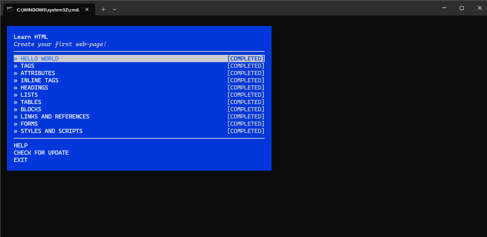

# Assignment 1: Course Setup and RCR
**CS 800 Research Methods, Spring 2026**
**Student:** Ashish Acharya

## Description
This assignment focuses on setting up the necessary development environment for the semester.
* Setting up the GitHub repository and local environment.
* Installing `npm` and the `learnyouhtml` workshop package.
* Completing the `learnyouhtml` exercises.

## Directory and File Structure
The files for this assignment are organized as follows:

* [html](./html/): Contains the solution files for the `learnyouhtml` workshop exercises and screenshot demonstrating the completion of the workshop.
* `ReadMe.md`: This file the very file you are reading right now, documenting the assignment submission.

## Workshop Completion
Below is the screenshot showing the successful completion of the `learnyouhtml` workshop.

## Video Demonstration
I have recorded a video demonstrating:
1. Listing the files in the assignment directory  
2. Navigating to the `html/` directory  
3. Running `learnyouhtml` and showing the completion screen

**YouTube Link:** [https://youtu.be/oKlOwBzzKXM](https://youtu.be/oKlOwBzzKXM)