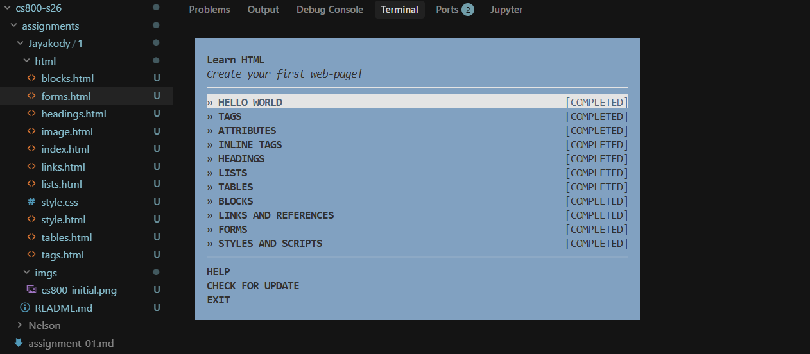

# Assignment 1: HTML Workshop Completion

## Assignment Description

This assignment involves completing the `learnyouhtml` workshop, which is an interactive tutorial designed to teach fundamental HTML concepts. The workshop consists of 11 exercises covering various HTML elements including tags, attributes, headings, lists, tables, forms, links, and other elements.

## Directory Structure

- `Jayakody/1/`
  - `html/` - Contains all HTML exercise files
    - `blocks.html`
    - `forms.html`
    - `headings.html`
    - `image.html`
    - `index.html`
    - `links.html`
    - `lists.html`
    - `style.html`
    - `style.css`
    - `tables.html`
    - `tags.html`
  - `imgs/` - Contains screenshots and images
    - `cs800-initial.png`
  - `README.md` - This file

## Files Description

### HTML Files (`html/` directory)

All HTML files follow the standard HTML5 structure with proper DOCTYPE, head, and body elements:

- **index.html** - Initial HTML document (Hello World exercise)
- **tags.html** - Demonstrates inline text formatting tags (`<strong>`, `<em>`, ``, ``, ``) with microscopy-related content
- **image.html** - Contains an image element with `src` and `alt` attributes
- **headings.html** - Shows heading hierarchy (`<h1>`, `<h2>`, `<h3>`) 
- **lists.html** - Demonstrates ordered lists (`<ol>`), unordered lists (`<ul>`), and definition lists (`<dl>`) with microscopy terminology
- **tables.html** - Creates a table with header row (`<th>`) and data rows (`<td>`) showing countries by continent
- **blocks.html** - Implements semantic HTML5 elements (`<header>`, `<nav>`, `<main>`, `<article>`, `<section>`, `<aside>`, `<footer>`)
- **links.html** - Contains a clickable image 
- **forms.html** - Creates a form with login and password input fields and a submit button
- **style.html** - Demonstrates inline styles, linked stylesheets, and JavaScript scripts (Exercise 11)
- **style.css** - External CSS stylesheet file linked from style.html

### Images (`imgs/` directory)

- **cs800-initial.png** - Screenshot showing completion of all 11 exercises in the learnyouhtml workshop

## Workshop Completion Screenshot

The following screenshot demonstrates successful completion of all 11 exercises in the learnyouhtml workshop:

All exercises have been completed:
- HELLO WORLD - Done
- TAGS - Done
- ATTRIBUTES - Done
- INLINE TAGS - Done
- HEADINGS - Done
- LISTS - Done
- TABLES - Done
- BLOCKS - Done
- LINKS AND REFERENCES - Done
- FORMS - Done
- STYLES AND SCRIPTS - Done

## YouTube Video Demonstration

The following video demonstrates:
1. Listing all files in the directory structure
2. Showing the completion screen for the learnyouhtml workshop

**Video Link:** [YouTube Video](https://youtu.be/-1wvbjWbCcg)

---

*This assignment was completed as part of CS 800 Research Methods, Spring 2026 at Old Dominion University.*