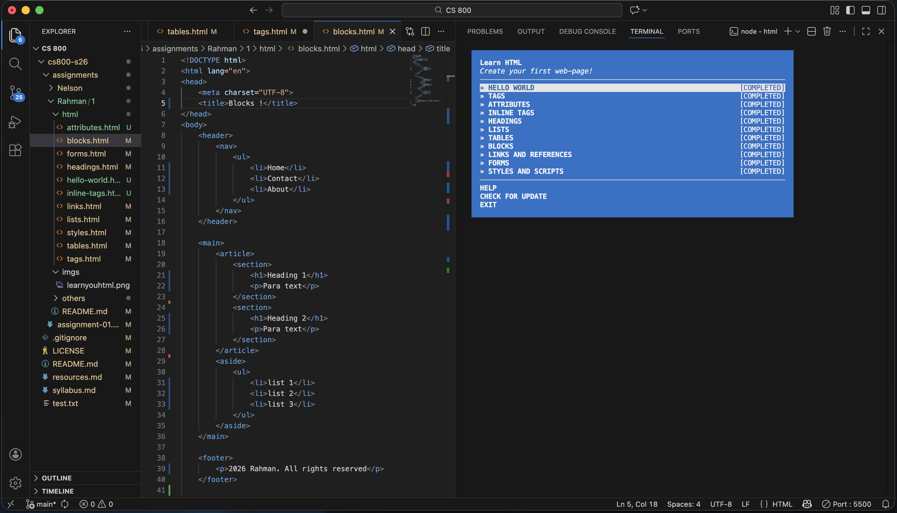

# Assignment 1: Course Setup and PCR

## Description
This is the implementation of `learnyouhtml`.

## Directory

Directory extract cmd:
``tree /A /F > "file_name.txt"``

\---Rahman
    |   directory_extract.txt
    |   
    \---1
        |   README.md
        |   
        +---html
        |       blocks.html
        |       forms.html
        |       headings.html
        |       image.html
        |       index.html
        |       links.html
        |       lists.html
        |       tables.html
        |       tags.html
        |       
        \---imgs
                learnyouhtml-2of11.png

## Completion Link
YouTube: [https://youtu.be/G22rfYGr-4Q](https://youtu.be/G22rfYGr-4Q)

## CMD used
`ls - mkdir - cd`
