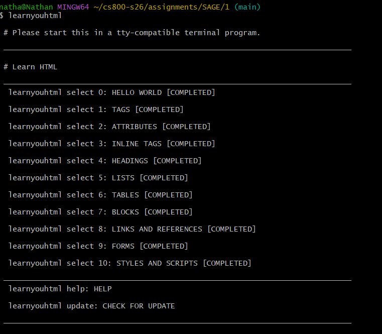

# Assignment 1

## 📁 Project Structure

Each assignment is organized into its own directory containing the corresponding HTML files.

- [01-hello-world](./html0)
- [02-tags](./html1)
- [03-attributes](./html2)
- [04-inline-tags](./html3)
- [05-headings](./html4)
- [06-lists](./html5)
- [07-tables](./html6)
- [08-blocks](./html7)
- [09-links-and-references](./html8)
- [10-forms](./html9)
- [11-styles-and-scripts](./html10)

---

**YouTube Link:**  
https://youtu.be/UovySLwxFUA

---

