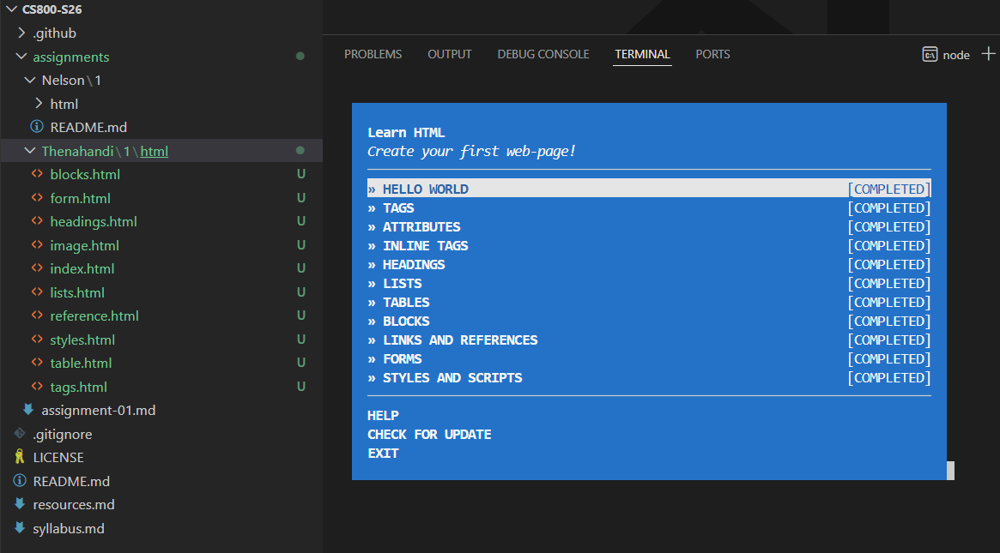

# Assignment 1

This is my submission for Assignment 1.

## Folder Structure

* [html](html) - Contains all HTML exercise files
  * [index.html](html/index.html) - Exercise 1: Hello World
  * [tags.html](html/tags.html) - Exercise 2: Tags
  * [image.html](html/image.html) - Exercise 3: Attributes
  * [tags.html](html/tags.html) - Exercise 4: Inline Tags
  * [headings.html](html/headings.html) - Exercise 5: Headings
  * [lists.html](html/lists.html) - Exercise 6: Lists
  * [table.html](html/table.html) - Exercise 7: Tables
  * [blocks.html](html/blocks.html) - Exercise 8: Blocks
  * [reference.html](html/reference.html) - Exercise 9: Links and References
  * [form.html](html/form.html) - Exercise 10: Forms
  * [styles.html](html/styles.html) - Exercise 11: Styles and Scripts

## Screenshot

## Youtube Video

* The video of the files and test completion pages is available at: [https://youtu.be/xaTUI4HTwFU](https://youtu.be/xaTUI4HTwFU)
