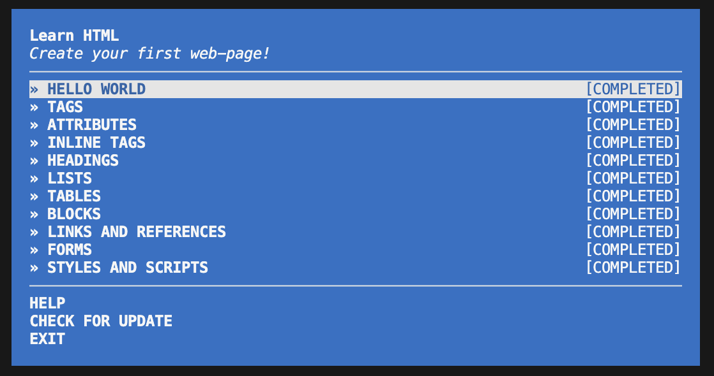

## Assignment 1 - Course Setup and RCR

CS 800 Research Methods, Spring 2026

### Description

This assignment covers the basic setup for the course, including learning HTML fundamentals through the `learnyouhtml`.

### Directory Structure

* [html](html) - Contains all HTML exercise files created during the learnyouhtml workshop

### HTML Files

The following HTML files demonstrate completion of the learnyouhtml exercises:
- `first-page.html` - Basic HTML page structure
- `tags.html` - HTML tags usage
- `attributes.html` - HTML attributes
- `inline-tags.html` - Inline elements
- `headings.html` - Heading elements (h1-h6)
- `lists.html` - Ordered, unordered, and definition lists
- `tables.html` - HTML tables
- `blocks.html` - Block elements (div, section, article)
- `links-images.html` - Links and images
- `forms.html` - HTML forms
- `styles.html` - CSS styling

### Screenshot of Completion
It is in the path: cs800-s26/assignments/chitikela/1/learnyouhtml-completion.png

### Video Demonstration

The video of the files and test completion pages is available at: [https://www.youtube.com/watch?v=UbCqtWFU5iw]
