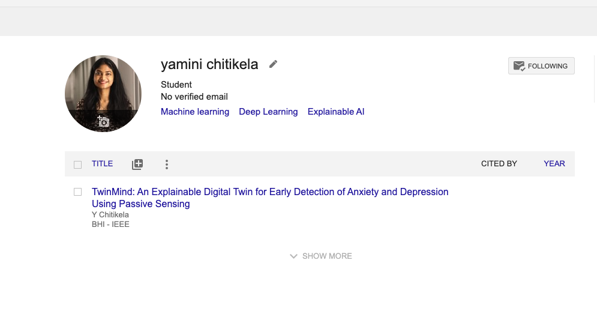
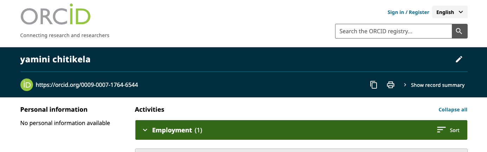
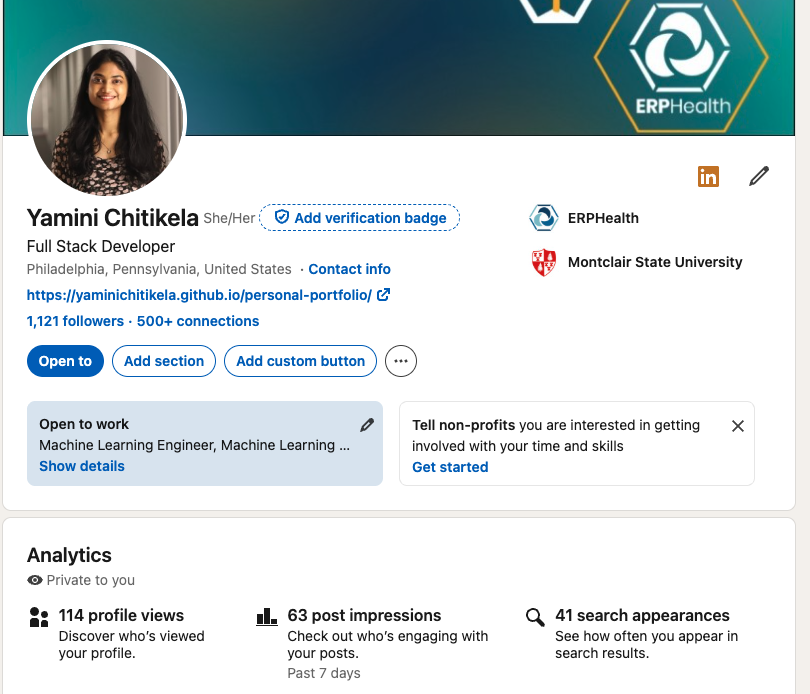
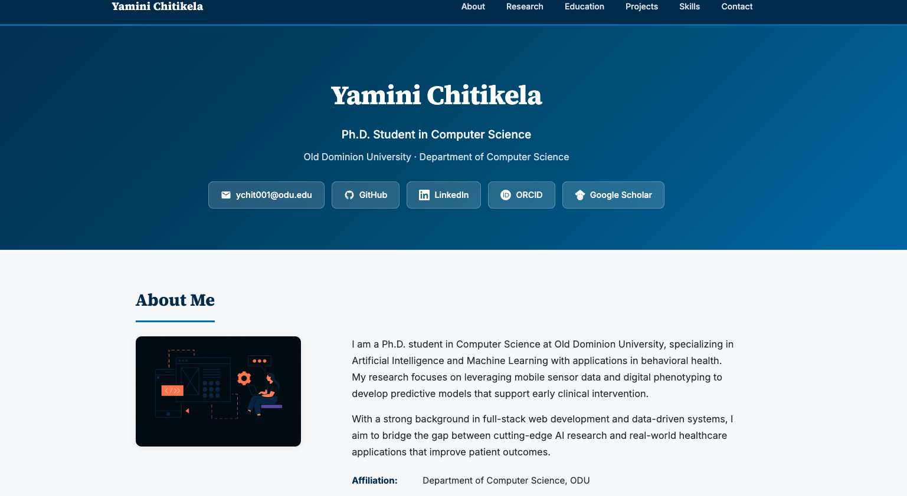
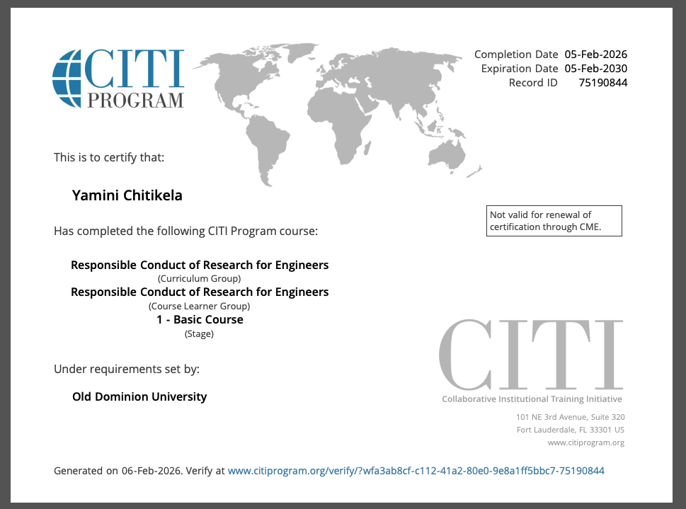
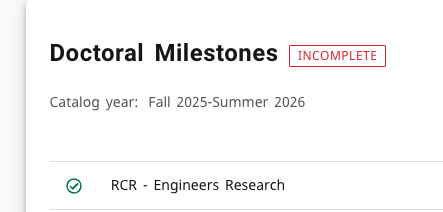

# Assignment 2: Presence, Tools, RCR

**CS 800 Research Methods, Spring 2026**

## Description

This assignment focuses on building a professional online presence by creating and linking multiple accounts, learning LaTeX/Overleaf, and completing Responsible Conduct of Research (RCR) training. All accounts include a bio and profile picture, with bidirectional linkage so each account can be discovered from the others.

## Directory Structure

* [imgs/](imgs/) - Contains screenshots of accounts, RCR completion, etc.
* [CS800_LaTeX_chitikela.pdf](CS800_LaTeX_chitikela.pdf) - LaTeX PDF generated from Overleaf

---

## Professional Accounts & Links

### Google Scholar

**Profile:** [https://scholar.google.com/citations?user=-XV8_74AAAAJ&hl=en](https://scholar.google.com/citations?user=-XV8_74AAAAJ&hl=en)

**ODU CS faculty I am following:**

1. Dr. Michael L. Nelson
2. Dr. Michele C. Weigle
3. Dr. Chunjiang Zhu
4. Dr. Ravi Mukkamala
5. Dr. Lusi Li

### ORCID

**ORCID iD:** [https://orcid.org/0009-0007-1764-6544](https://orcid.org/0009-0007-1764-6544)

### LinkedIn

**Profile:** [https://www.linkedin.com/in/yaminichitikela/](https://www.linkedin.com/in/yaminichitikela/)

### Academic Webpage

**URL:** [https://cs.odu.edu/~cs_ychit001/](https://cs.odu.edu/~cs_ychit001/)

---

## LaTeX and Overleaf

- Signed up for a free [Overleaf](https://overleaf.com) account.
- Completed [Part 1](https://www.overleaf.com/learn/latex/Free_online_introduction_to_LaTeX_(part_1)) of the LaTeX introduction.
- Used the template from [slide 65](https://www.overleaf.com/read/wdpmbwqbrzpm) and substituted URLs, images, and text with my own information.
- PDF: [CS800_LaTeX_chitikela.pdf](CS800_LaTeX_chitikela.pdf)

---

## Responsible Conduct of Research (RCR)

- Completed RCR training via [ODU Impact - Responsible Conduct of Research](https://www.odu.edu/impact/responsible-conduct-of-training).
- Course: "Responsible Conduct of Research for Engineers"

---

## YouTube Video Walkthrough

A narrated walkthrough of all accounts, tools, and RCR completion is available at:

**Video Link:** [https://www.youtube.com/watch?v=K0QPGJ0SOrA](https://www.youtube.com/watch?v=K0QPGJ0SOrA)

The video covers:

- Academic webpage and linkage to other accounts
- Google Scholar profile and followed faculty/scholars
- ORCID profile
- LinkedIn profile
- LaTeX/Overleaf and the customized PDF
- RCR training completion
- Overview of this README and submission structure
